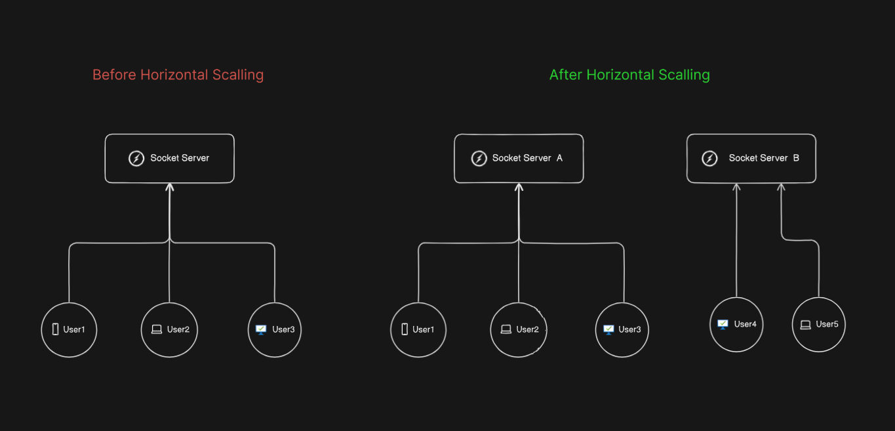
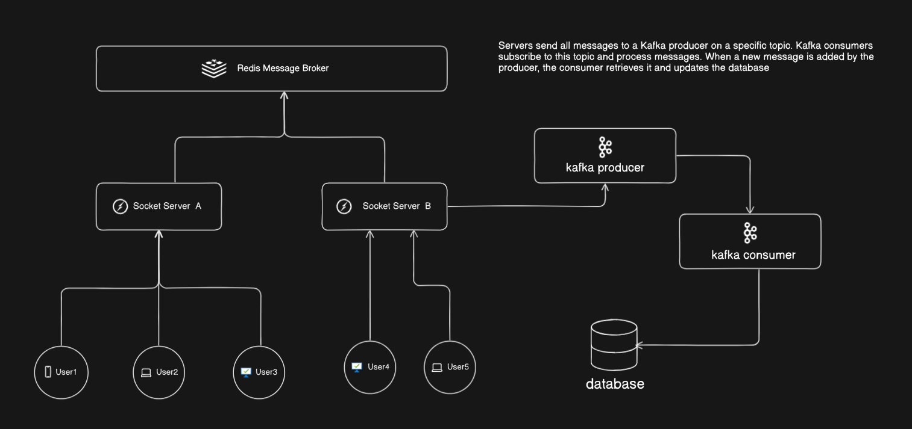

# Scaling Node.js Socket.io Server  

This project demonstrates a scalable Socket.io server capable of handling a high volume of user connections and real-time communication. The system solves the challenges of horizontal scaling by introducing a message broker to synchronize messages across multiple server instances.  

---

## Problem  

As user traffic increases, a single server instance can no longer handle all connections. Horizontal scaling (adding more server instances) creates a new issue:  
- Users connected to different server instances cannot exchange messages directly, as the servers are isolated.  

Here’s an illustration of the problem:  
  

---

## Solution  

A message broker is integrated into the architecture to synchronize messages between server instances. This setup ensures that users connected to different servers can communicate seamlessly, as if they were on the same instance.

  

### Key Features of the System:  
- **Real-time synchronization** across server instances.  
- **Scalable architecture** for handling increased user traffic.  
- **Reliable message delivery** with no loss, even during server instance failures.  

### Technologies Used:  
- **Node.js** for the server.  
- **Socket.io** for real-time communication.  
- **Redis** as the message broker.  

---

## Additional Problem: Database Write Load  

When a large number of users send messages, the database write operations can become a bottleneck, significantly impacting performance. A direct approach to updating the database for each message is inefficient and can lead to high latency or crashes under heavy load.  

---

## Enhanced Solution: Kafka for Database Updates  

To handle the heavy database write load, Kafka, a high-throughput distributed messaging system, was integrated into the architecture.

### How It Works:  
1. **Message Producer**:  
   - When a user sends a message, it is added to a Kafka topic named `MESSAGES`.  

2. **Message Consumer**:  
   - A Kafka consumer listens to the `MESSAGES` topic.  
   - The consumer processes each message and writes it to the database in an optimized manner.

3. **Database Write Optimization**:  
   - Kafka’s high throughput ensures that messages are efficiently queued and processed without overloading the database.  
   - This architecture enhances both application performance and database reliability.  

---

### Benefits of Kafka Integration:  
- **High Throughput**: Kafka can handle a large volume of messages per second.  
- **Reduced Latency**: By batching database writes, latency is minimized.  
- **Scalability**: Kafka’s distributed nature allows the system to scale easily.  
- **Fault Tolerance**: Kafka ensures message delivery even in the case of server failures.  

### Updated Architecture:  

Client A <--> Server 1
|
Client B <--> Server 2
|
Redis (Message Broker)
|
Kafka (Message Queue)
|
Database (Persistent Storage)

---

## Conclusion  

By integrating Redis for real-time message synchronization and Kafka for database updates, this system achieves a scalable, efficient, and reliable architecture. It ensures seamless user communication and optimized database operations, even under heavy loads.  
